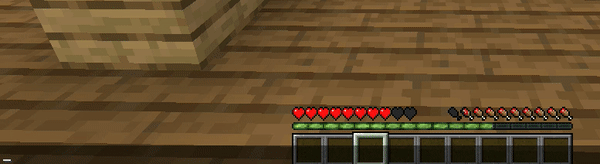
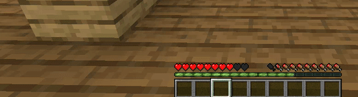

<p align="left">
  
</p>

> Version: **1.5-RELEASE**

## Installation
1. Install to local repo
```shell
   $ mvn install
```
2. Add as dependency
```xml
    <dependency>
        <groupId>uk.mqchinee</groupId>
        <artifactId>LanternCore</artifactId>
        <version>{version-here}</version>
        <scope>provided</scope>
    </dependency>
```

### OR 
*(not recommended)*

1. Add as dependency
```xml
    <dependency>
        <groupId>uk.mqchinee</groupId>
        <artifactId>LanternCore</artifactId>
        <version>{version-here}</version>
        <scope>system</scope>
        <systemPath>{path-to-jar}</systemPath>
    </dependency>
```

## Usage example

### Inventory-Based GUI creation
> extended version of [@focamacho](https://github.com/focamacho)'s [SealMenus](https://github.com/focamacho/SealMenus)

```java
public class MyGUI {

    private final ChestMenu menu;

    public MyGUI() {
        // title, rows, plugin, is concurrent
    
        // (Allows you to choose between HashMap (recommended) and ConcurrentHashMap.
        //    If you want to get rid of ConcurrentModificationException
        // (occurs when using MovableItem), use ConcurrentHashMap)

        this.menu = MenuManager.createChestMenu("Buttons", 5, MyPlugin.getInstance(), true);
    }

    public void prepare() {

        // ItemStack, update

        ClickableItem S = ClickableItem.create(new ItemBuilder(Material.OAK_SIGN)
            .name("&emovable").build(), false);
        ClickableItem I = ClickableItem.create(new ItemBuilder(Material.OAK_SIGN)
            .name("&eloopable").build(), false);
        ClickableItem G = ClickableItem.create(new ItemBuilder(Material.OAK_SIGN)
            .name("&eclickable").build(), false);
        ClickableItem N = ClickableItem.create(new ItemBuilder(Material.OAK_SIGN)
            .name("&edynamic").build(), false);
        ClickableItem K = ClickableItem.create(new ItemBuilder(Material.OAK_SIGN)
            .name("&etoggleable").build(), false);

        // item, speed, menu, reverse, structure
        MovableItem M = MovableItem.create(
            new ItemBuilder(Material.QUARTZ).name("&fitem")).build(), 4, menu, true,
                "# % % % % % % % %",
                "# # # # # # # # #",
                "# # # # # # # # #",
                "# # # # # # # # #",
                "# # # # # # # # #"
        );
        M.setOnClick(e -> e.getWhoClicked().sendMessage("test"));

        LoopableItem L = LoopableItem.create(Arrays.asList(
            new ItemStack(Material.DIAMOND),
            new ItemStack(Material.GOLD_INGOT),
            new ItemStack(Material.IRON_INGOT)),
        20);

        ClickableItem C = ClickableItem.create(new ItemStack(Material.OAK_BUTTON), false);
        C.setOnPrimary(e -> e.getWhoClicked().sendMessage("hi, "+e.getWhoClicked().getName()));

        DynamicItem D = DynamicItem.create(new ItemStack(Material.OAK_LEAVES), menu);
        D.setOnClick(e -> D.replace(new ItemStack(Material.BARRIER), 20));

        ItemStack on = new ItemBuilder(Material.GREEN_STAINED_GLASS)
            .name("&fSomething &aENABLED").build();
        ItemStack off = new ItemBuilder(Material.RED_STAINED_GLASS)
            .name("&fSomething &cDISABLED").build();

         // enabled, disabled, toggle on click
        ToggleableItem T = ToggleableItem.create(on, off, true);

        Structure structure = new Structure(
                "S M # # # # # # #",
                "I # # # L # # # #",
                "G # # # C # # # #",
                "N # # # D # # # #",
                "K # # # T # # # #"
        )
                .set('S', S)
                .set('I', I)
                .set('G', G)
                .set('N', N)
                .set('K', K)
                .set('M', M)
                .set('L', L)
                .set('C', C)
                .set('D', D)
                .set('T', T);

        structure.process(menu);
    }

    public void open(Player player) {
        prepare();
        menu.open(player);
    }

}
```

<p align="center">
  
</p>


```java
@InventoryStructure({
  "C A C C B C C A C",
  "C % % % % % % % C",
  "C % % % % % % % C",
  "C % % % % % % % C",
  "C % % % % % % % C",
  "C < C C C C C > C"
})
public class MyGUI {

    private final PageableChestMenu menu;

    public MyGUI() {
        this.menu = MenuManager.createPageableChestMenu("Dirt", 6, MyPlugin.getInstance(), false);
    }

    public void prepare() {

        ClickableItem C = ClickableItem.create(new ItemStack(Material.GRAY_STAINED_GLASS_PANE), false);
        ClickableItem A = ClickableItem.create(new ItemStack(Material.EMERALD), false);
        ClickableItem B = ClickableItem.create(new ItemStack(Material.BOOK), false);

        Structure s = Structure.getFromAnnotation(this.getClass())
                .set('C', C)
                .set('A', A)
                .set('B', B)
                .set('<', ClickableItem.create(new ItemStack(Material.SPECTRAL_ARROW), false))
                .set('>', ClickableItem.create(new ItemStack(Material.SPECTRAL_ARROW), false));

        s.process(menu);

        for(int i = 1; i < 64; i++) {
            menu.addPageableItem(ClickableItem.create(new ItemStack(Material.DIRT, i), false));
        }

    }

    public void open(Player player) {
        prepare();
        menu.open(player);
    }

}
```

<p align="center">
  
</p>


### Creating commands

```java
@CommandInfo()
public class MySimpleCommand extends AbstractCommand {
    public MySimpleCommand() {
        super("command", MyPlugin.getInstance());
    }

    @Override
    public List<String> complete(CommandSender commandSender, String[] strings) {
        return null;
    }

    @Override
    public void sub(CommandSender commandSender, String[] strings) {}

    @Override
    public void execute(CommandSender commandSender, String s, String[] strings) {
        commandSender.sendMessage("Hello, world!");
    }
}
```

```java
@Override
    public void onEnable() {
        new MySimpleCommand();
    }
```

<p align="center">
  
</p>

```java
@CommandInfo(
        permission = "myplugin.worldcommand",
        permission_message = "&cYou don't have permission to do that.",
        filter = SenderFilter.PLAYER,
        filter_message = "&cThis command can only be used by players."
)
public class WorldCommand extends AbstractCommand {
    public WorldCommand() {
        super("world", MyPlugin.getInstance());
    }

    @Override
    public List<String> complete(CommandSender commandSender, String[] strings) {
        return Arrays.asList("hello", "goodbye", "echo");
    }

    @Override
    public void sub(CommandSender commandSender, String[] strings) {
        subCommand(new Hello(this, commandSender, strings));
        subCommand(new Goodbye(this, commandSender, strings));
        subCommand(new Echo(this, commandSender, strings));
    }

    @Override
    public void execute(CommandSender commandSender, String s, String[] strings) {
        commandSender.sendMessage(":)");
    }
}
```

```java
@SubCommandInfo()
public class Hello extends SubCommand {
    public Hello(AbstractCommand parent, CommandSender sender, String[] args) {
        super(parent, sender, args, false); // hasArgs: false
    }

    @Override
    public String getName() {
        return "hello";
    }

    @Override
    public void execute() {
        getSender().sendMessage("Hello, World!");
    }
}
```

```java
@SubCommandInfo()
public class Goodbye extends SubCommand {
    public Goodbye(AbstractCommand parent, CommandSender sender, String[] args) {
        super(parent, sender, args, false);
    }

    @Override
    public String getName() {
        return "goodbye";
    }

    @Override
    public void execute() {
        getSender().sendMessage("Goodbye, World!");
    }
}
```

```java
  @SubCommandInfo(
        permission = "myplugin.echo",
        permission_message = "&cYou don't have permission to do that.",
        filter = SenderFilter.PLAYER, // SenderFilter.CONSOLE, SendFilter.BOTH
        filter_message = "&cThis command can only be used by players.",
        no_args_message = "&cUsage: /world echo &oINTEGER",
        regex = "[0-9]+",
        regex_message = "&cUsage: /world echo &oINTEGER"
)
public class Echo extends SubCommand {
    public Echo(AbstractCommand parent, CommandSender sender, String[] args) {
        super(parent, sender, args, true); // hasArgs: true
    }

    @Override
    public String getName() {
        return "echo";
    }

    @Override
    public void execute() {
        getSender().sendMessage(getArgs()[1]);
    }
}
```

```java
@Override
    public void onEnable() {
        new WorldCommand();
    }
```

<p align="center">
  
</p>

*More examples will be added soon...*
